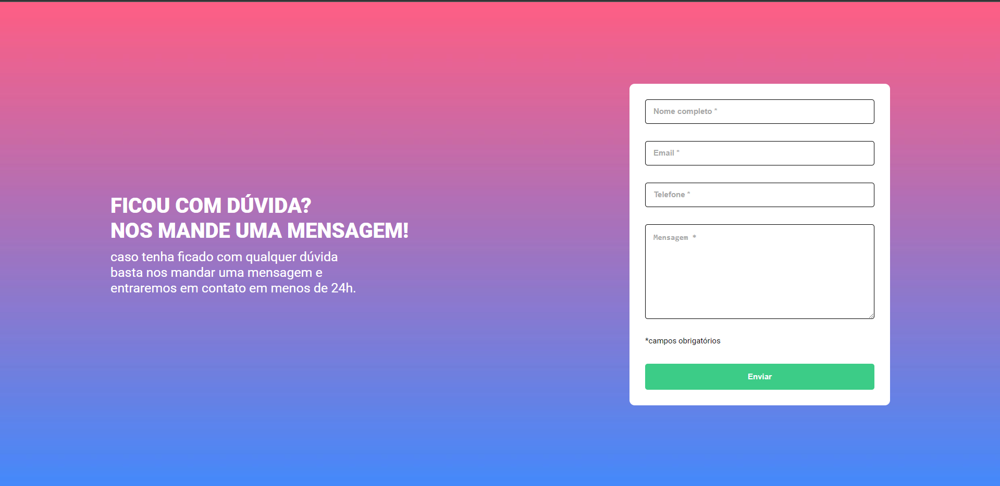

# 📜 Valadição de formulário 📜

### Quest HTML, CSS e JAVASCRIPT.

 

### Descrição:

Projeto feito no curso DevQuest FrontEnd, esse projeto foi feito com o intuito de aprimorar, fixar e por em prática as habilidades que estamos aprendendo dentro do curso.

### Tecnologias Utilizadas:

    
    
    

 

### 📸 Screenshot:

